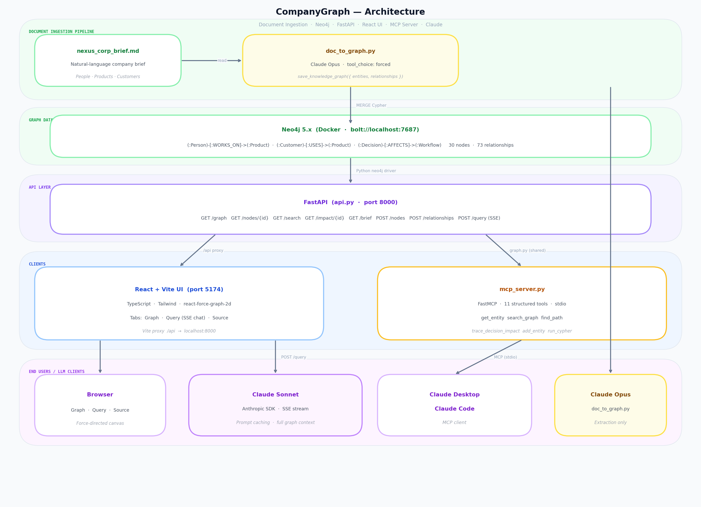
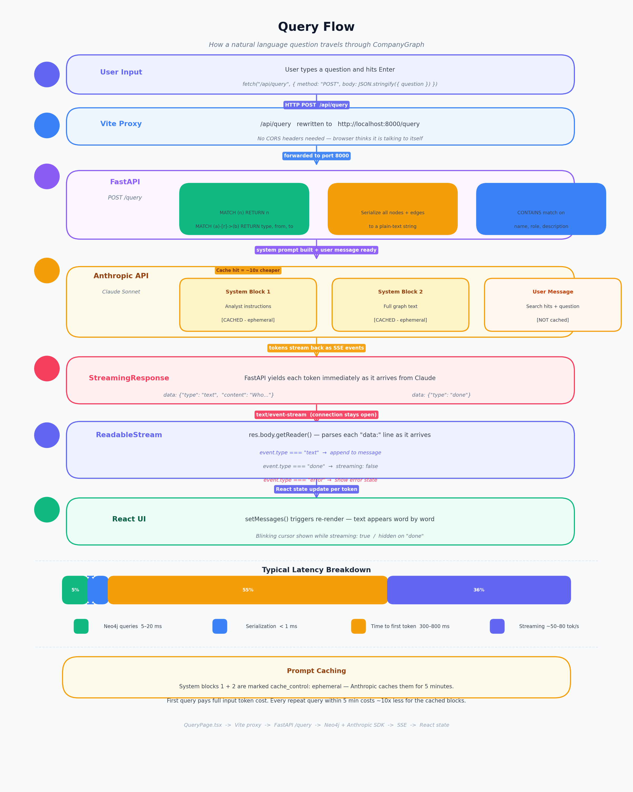
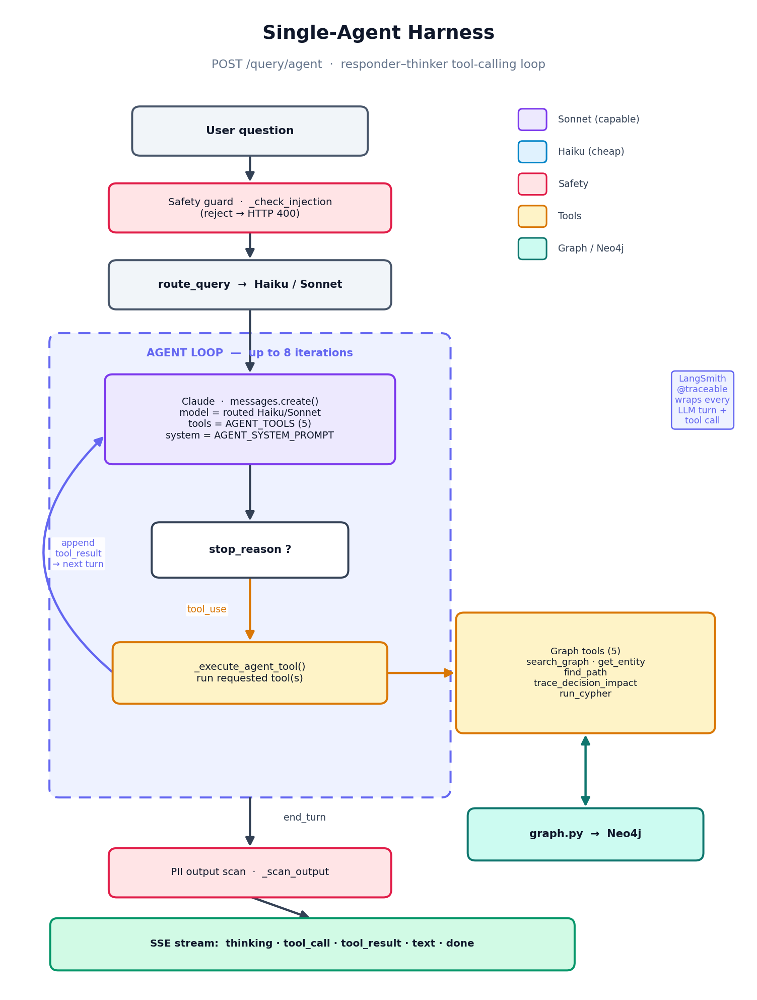
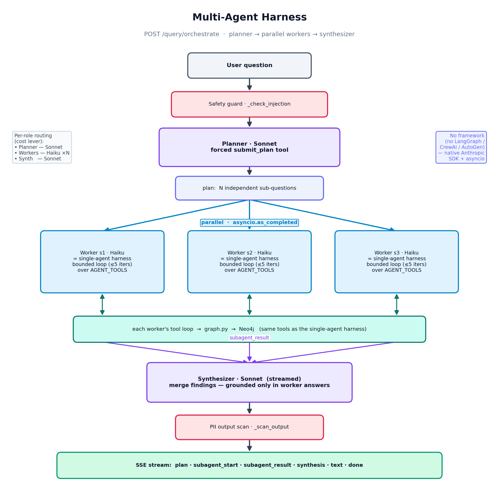

# CogniGraph

A Neo4j knowledge graph connecting **People → Products → Customers → Workflows → Decisions**, built from plain-text documents via Claude, and exposed via a REST API, a React UI, and an MCP server.

Themed around **Meridian Property Group** — a PropTech SaaS company for residential and commercial property management — to demonstrate AI architecture patterns relevant to the property technology domain: lease management, maintenance workflows, fair housing compliance, and owner analytics.

## Repository Layout

```
backend/        Python source (api.py, graph.py, seed.py, eval.py …) + prompts/
docs/           Project documentation (USER_GUIDE, DEVELOPER_GUIDE, DESIGN_DECISIONS …)
tests/          pytest test suite (unit + integration)
scripts/        CI utility scripts (validate_prompts.py, check_eval_regression.py)
UI/             React + Vite frontend
.github/        GitHub Actions CI/CD workflows
```

**Detailed docs:** [`docs/USER_GUIDE.md`](docs/USER_GUIDE.md) · [`docs/DEVELOPER_GUIDE.md`](docs/DEVELOPER_GUIDE.md) · [`docs/DESIGN_DECISIONS.md`](docs/DESIGN_DECISIONS.md)

## Document Ingestion Pipeline

The graph data originates from a plain-text company brief — the kind of document that already exists in any company's wiki or shared drive. A single script converts it into a queryable knowledge graph using Claude as the extraction engine.

```
nexus_corp_brief.md          (source: internal company document)
        │
        │  python doc_to_graph.py
        ▼
  Claude Opus (tool use)      ← structured extraction, no hallucination guard needed
        │                        because tool_choice forces one exact tool call
        │  save_knowledge_graph({ entities: [...], relationships: [...] })
        ▼
  doc_to_graph.py             ← validates schema, builds MERGE Cypher statements
        │
        ▼
  Neo4j (graph.py layer)      ← same driver used by REST API + MCP server
        │
        ▼
  30 nodes · 71 relationships ← queryable via UI, API, or Claude Desktop
```

### How it works

**1. Source document** — [`nexus_corp_brief.md`](nexus_corp_brief.md) is written in natural prose: team bios, product descriptions, customer profiles, workflows, and strategic decisions. No schema required from the author.

**2. Claude extracts structure** — `doc_to_graph.py` sends the full document to Claude Opus with a single tool definition (`save_knowledge_graph`) whose input schema mirrors the Neo4j data model. `tool_choice: {type: "tool"}` forces exactly one structured call — no parsing of free-form text.

**3. Entities and relationships loaded** — The tool's output (a list of typed entities + directed relationships) is written to Neo4j using `MERGE` statements via `graph.py`, the same layer used by the REST API and MCP server.

```bash
# Preview what Claude extracts (no Neo4j writes)
python doc_to_graph.py --dry-run

# Load extracted graph (clears existing data first)
python doc_to_graph.py --clear

# Use your own document
python doc_to_graph.py --file my_company.md --clear
```

### Why this matters

Most knowledge graph demos hand-craft seed data. This pipeline shows the realistic path: **unstructured document → LLM extraction → graph database → natural language query**. The same approach works for org charts, engineering RFCs, sales notes, or any prose-heavy internal document.

## Architecture



<details>
<summary>ASCII version</summary>

```
┌─────────────────────────────────────────────────────────────────┐
│                        Browser / Claude                         │
└────────────┬───────────────────────────┬────────────────────────┘
             │                           │
             ▼                           ▼
┌────────────────────────┐   ┌───────────────────────────────────┐
│    React + Vite UI     │   │        Claude Desktop / Code      │
│   (TypeScript, :5173)  │   │            MCP Client             │
│  Graph · Query · Observe│  └───────────────┬───────────────────┘
│  ┌──────────────────┐  │                   │ MCP protocol (stdio)
│  │ Force-graph canvas│  │  ┌───────────────▼───────────────────┐
│  │ Query chat (SSE)  │  │  │      mcp_server.py (FastMCP)      │
│  │  Std│Agent│Multi  │  │  │      11 tools ──► graph.py        │
│  │ Observe metrics   │  │  └───────────────┬───────────────────┘
└──────────┬───────────┘                     │
           │ /api proxy                       │
           ▼                                 ▼
┌─────────────────────────────────────────────────────────────────┐
│                    FastAPI  (api.py, :8000)                     │
│                                                                 │
│  Graph/CRUD : GET /graph · /nodes · /impact · /path · /metrics  │
│  Search     : GET /search  ──►  hybrid: BM25 + semantic (RRF)   │
│  LLM modes (SSE):                                               │
│    POST /query             routed + full-graph cached prompt    │
│    POST /query/agent       single-agent tool-calling loop       │
│    POST /query/orchestrate planner → ‖workers‖ → synthesizer    │
│                                  │                              │
│   route_query (direct/Haiku/Sonnet) · injection + PII guards    │
│                                  ▼                              │
│   Anthropic SDK (Haiku/Sonnet) · prompt caching · LangSmith     │
│   local embeddings (sentence-transformers, hybrid search arm)   │
└──────────────────────────┬──────────────────────────────────────┘
                           │  Python neo4j driver  (bolt://7687)
                           ▼
┌─────────────────────────────────────────────────────────────────┐
│                     Neo4j 5.x  (Docker)                         │
│                                                                 │
│   (:Person)  ──[:WORKS_ON]──►  (:Product)                       │
│   (:Customer)──[:USES]──────►  (:Product)                       │
│   (:Decision)──[:AFFECTS]───►  (:Workflow | :Product | :Customer)│
│   (:Person)  ──[:OWNS]──────►  (:Workflow)                      │
│                                                                 │
│   30 nodes · 71 relationships                                   │
└─────────────────────────────────────────────────────────────────┘
```

</details>

### Key design decisions

| Concern | Decision |
|---------|----------|
| Graph storage | Neo4j — relationships are first-class, Cypher queries are expressive |
| API layer | FastAPI — async, auto-docs, thin wrapper around `graph.py` |
| LLM integration | Full graph serialized into a **cached system prompt** — no RAG chunking needed at this scale |
| Streaming | SSE (`StreamingResponse`) so the UI renders tokens as they arrive |
| Search | Hybrid — BM25 (lexical) + local `sentence-transformers` embeddings (semantic), fused with RRF |
| Query modes | Routed single-turn (`/query`), single-agent tool loop (`/query/agent`), multi-agent orchestration (`/query/orchestrate`) |
| Multi-agent | Planner → parallel workers → synthesizer over the native SDK; per-role model routing (Sonnet planner/synth, Haiku workers) |
| Frontend proxy | Vite `/api` → `localhost:8000` — no CORS config required in dev |
| MCP | Same `graph.py` functions reused — one source of truth for all clients |

## Query Flow



How a natural language question travels through the system when a user types in the Query tab. The Query tab offers three modes — the **standard** routed flow is detailed below; the **multi-agent** flow follows in its own diagram.

| Mode | Endpoint | Shape |
|------|----------|-------|
| Standard | `POST /query` | route → full-graph cached prompt → stream (or direct no-LLM for list/count) |
| Single-agent | `POST /query/agent` | one agent iteratively calls graph tools until done |
| Multi-agent | `POST /query/orchestrate` | planner → parallel workers → synthesizer |

### Step-by-step (standard `/query`)

**1. User input → Frontend** (`UI/src/components/QueryPage.tsx`)

User hits Enter. The component opens a streaming fetch:
```ts
fetch('/api/query', { method: 'POST', body: JSON.stringify({ question }) })
// response body held open as a ReadableStream
```

**2. Vite proxy** (`vite.config.ts`)

The `/api` prefix is rewritten transparently — no CORS headers needed:
```
/api/query  →  http://localhost:8000/query
```

**3. FastAPI receives `POST /query`** (`api.py`)

Three things happen before the LLM is called:

| Step | Code | What it does |
|------|------|--------------|
| Full graph load | `g.get_full_graph()` | Two Cypher queries — all nodes + all relationships |
| Serialization | `_format_graph(graph)` | Converts every node and edge to a readable text string |
| Keyword search | `g.search_nodes(question)` | `CONTAINS` match on `name`, `description`, `role` fields |

**4. Anthropic SDK call with prompt caching**

```python
async with _anthropic.messages.stream(
    model="claude-sonnet-4-6",
    system=[
        { "text": SYSTEM_PROMPT,  "cache_control": {"type": "ephemeral"} },  # cached
        { "text": graph_context,  "cache_control": {"type": "ephemeral"} },  # cached
    ],
    messages=[{ "role": "user", "content": f"{search_hits}\n\nQuestion: {question}" }]
)
```

The two system blocks are marked `ephemeral` — Anthropic caches them for 5 minutes. The first query in a session pays full token cost; every subsequent query hits the cache and costs ~10× less for input tokens. The user message is never cached (unique per query).

**5. SSE stream back to browser** (`api.py`)

Tokens are forwarded to the client the moment they arrive:
```python
async for text in stream.text_stream:
    yield f"data: {json.dumps({'type': 'text', 'content': text})}\n\n"
yield f"data: {json.dumps({'type': 'done'})}\n\n"
```

**6. Frontend renders tokens as they arrive** (`QueryPage.tsx`)

```ts
const event = JSON.parse(line.slice(6))   // strip "data: "
if (event.type === 'text') {
    // append token → React re-renders → text appears word by word
}
if (event.type === 'done') {
    // set streaming: false → blinking cursor disappears
}
```

### End-to-end diagram

```
QueryPage.tsx
    │  POST /api/query  { question }
    ▼
Vite proxy  →  rewrites to http://localhost:8000/query
    ▼
FastAPI  POST /query
    ├─► Neo4j:  MATCH (n) RETURN n
    │           MATCH (a)-[r]->(b) RETURN type, from_id, to_id   (~5–20 ms)
    │           MATCH (n) WHERE name CONTAINS kw  (keyword search)
    │
    ├─► _format_graph()  →  plain-text representation of all nodes + edges
    │
    └─► AsyncAnthropic.messages.stream()
            system[0]: analyst instructions   ← CACHED (5 min TTL)
            system[1]: full graph text        ← CACHED (5 min TTL)
            user:      search hits + question   (not cached)
                │
                │  token stream
                ▼
        StreamingResponse  media_type="text/event-stream"
                │
                │  data: {"type":"text","content":"Who…"}\n\n
                │  data: {"type":"text","content":" works…"}\n\n
                │  data: {"type":"done"}\n\n
                ▼
        res.body.getReader()  in browser
                │
                ▼
        setMessages(prev → append token)  →  re-render per token
```

### Multi-agent flow (`POST /query/orchestrate`)

When the Query tab is in **Multi-agent** mode, the question fans out across sub-agents instead of a single LLM call. The standard flow above is unchanged; this path is purely additive.

```
QueryPage.tsx  (Multi-agent toggle)
    │  POST /api/query/orchestrate  { question }
    ▼
FastAPI  POST /query/orchestrate          (injection guard runs first)
    │
    ├─► [1] Planner · Sonnet
    │        forced submit_plan tool ──► N independent sub-questions
    │        SSE:  { "type":"plan", "subtasks":[ s1, s2, s3 ] }
    │
    ├─► [2] Workers · Haiku × N        ‖ run IN PARALLEL (asyncio.as_completed) ‖
    │        each = bounded tool-calling loop over AGENT_TOOLS → graph.py → Neo4j
    │        SSE per worker:  subagent_start → … → subagent_result  (finish out of order)
    │
    └─► [3] Synthesizer · Sonnet   (streamed)
             merges findings (grounded only in worker answers) → PII scan
             SSE:  synthesis → text … → done
                    │
                    ▼
             done: { subtasks, tool_calls, latency_ms,
                     models:{ planner, worker, synthesizer } }
                    │
                    ▼
        UI renders: live fan-out panel (plan + per-worker status/tool count)
                    + per-role model badges  (planner Sonnet · N× worker Haiku · synth Sonnet)
```

All three roles reuse the same `graph.py` tools, prompt-injection filter, PII output scan, and LangSmith tracing as the single-agent path — **per-role model routing** (capable Sonnet for planning/synthesis, cheap Haiku for parallel workers) is the cost lever.

### Latency breakdown

| Phase | Typical time |
|-------|-------------|
| Neo4j queries | 5 – 20 ms |
| Graph serialization | < 1 ms |
| Keyword search | 5 – 15 ms |
| Time to first token (Anthropic) | 300 – 800 ms |
| Streaming throughput | ~50 – 80 tokens / sec |

## AI Architecture Features

### Agentic Query Mode (`POST /query/agent`)

Beyond the standard single-turn query, `/query/agent` runs a full **tool-calling agent loop**. Claude iteratively decides which graph tools to invoke, executes them, and reasons across results before producing a final answer — demonstrating the responder/thinker pattern described in modern agentic AI design.



```
User question
    │
    ▼
Claude (tool_use turn)
    ├─► search_graph("compliance workflow")   → entity list
    ├─► get_entity("w4")                      → Fair Housing Audit details + connections
    ├─► trace_decision_impact("d4")           → GDPR/CCPA blast radius
    └─► [end_turn] synthesized answer
```

Five tools are available to the agent: `search_graph`, `get_entity`, `find_path`, `trace_decision_impact`, `run_cypher`. The SSE stream emits typed events so the UI can render each step as it happens:

| Event type | What it carries |
|------------|----------------|
| `thinking` | Claude's intermediate reasoning text |
| `tool_call` | Tool name + input chosen by Claude |
| `tool_result` | Truncated result returned to Claude |
| `text` | Final answer tokens |
| `done` | Tool call count + total latency |

---

### Multi-Agent Orchestration (`POST /query/orchestrate`)

For broad, comparative questions, `/query/orchestrate` runs a **multi-agent** pattern — an orchestrator that decomposes the question, parallel workers that research each part, and a synthesizer that merges the findings. It's purely additive; `/query` and `/query/agent` are unchanged.



> **No agent framework.** No LangGraph, CrewAI, AutoGen, or LangChain agents — the orchestration is plain Python on the Anthropic SDK (`messages.create` / `messages.stream`), with stdlib `asyncio.as_completed` for the parallel worker fan-out. Same rationale as the single-agent loop: full control and traceability over every turn, custom SSE events, and per-role model routing — none of which a framework abstraction makes easier here.

```
User question
    │
    ▼
[Planner · Sonnet]  ──►  decomposes into N independent sub-questions (forced submit_plan tool)
    │
    ├─►  [Worker s1 · Haiku] ─┐   each worker is a bounded tool-calling loop
    ├─►  [Worker s2 · Haiku] ─┤   over the same AGENT_TOOLS, run in PARALLEL
    └─►  [Worker s3 · Haiku] ─┘   (asyncio.as_completed)
    │
    ▼
[Synthesizer · Sonnet]  ──►  one grounded answer, streamed
```

**Per-role model routing is the cost lever:** the planner and synthesizer use the capable model (Sonnet) where reasoning matters; the parallel workers use the cheap model (Haiku). All roles reuse the same `graph.py` tools, prompt-injection filter, and PII output scan. SSE events extend the agent set:

| Event type | What it carries |
|------------|----------------|
| `plan` | The decomposed sub-questions + planner model |
| `subagent_start` | A worker began (id, question, model) |
| `subagent_result` | A worker finished (id, answer preview, tool calls) |
| `synthesis` | The synthesizer started (model) |
| `text` / `done` | Final answer tokens / sub-agent + tool counts, latency, per-role models |

Models are env-overridable (`ORCH_PLANNER_MODEL`, `ORCH_WORKER_MODEL`, `ORCH_SYNTH_MODEL`, `ORCH_MAX_SUBTASKS`). In the UI, the **Query tab → Multi-agent toggle** shows the fan-out live: the plan, each sub-agent's status and tool count, then the synthesis.

---

### Model Routing

Every query is classified before an LLM is called:

| Route | Trigger | Cost |
|-------|---------|------|
| **Direct** (no LLM) | List / count queries (`how many workflows`, `list all products`) | ~0 ms, $0 |
| **Claude Haiku** | Simple single-entity lookups (≤12 words, no multi-hop indicators) | Fast, cheap |
| **Claude Sonnet** | Complex reasoning: `impact`, `trace`, `depend`, `compliance`, `path`, etc. | Full quality |

```python
route_query("who owns the lease renewal workflow")
# → "claude-haiku-4-5-20251001"

route_query("trace the impact of the GDPR compliance decision on workflows")
# → "claude-sonnet-4-6"
```

---

### Hybrid Search (BM25 + Semantic)

All search operations — `/search`, the standard `/query` endpoint, and the agent's `search_graph` tool — use a **true hybrid retriever**: a BM25 lexical arm and a semantic embedding arm, fused with Reciprocal Rank Fusion (RRF).

- **Lexical arm (BM25):** weighs terms by inverse document frequency and normalizes for document length, so "compliance audit" ranks `Fair Housing Audit` above nodes containing only one of the two words. Pure Python.
- **Semantic arm:** embeds the query and every node with a local `sentence-transformers` model (`all-MiniLM-L6-v2`, 384-dim) and ranks by cosine similarity — so "protecting user information" surfaces the `GDPR and CCPA Compliance Overhaul` decision even though it shares no words with the query.
- **Fusion (RRF):** the two ranked lists are merged by `1/(k+rank)` (k=60), which is score-scale agnostic and lets lexical-only and semantic-only hits both survive.

```python
hybrid_search_nodes("lease renewal compliance")
# Lexical BM25 ranking + semantic cosine ranking, fused via RRF
# Embeds name + description + role + rationale; returns ranked results
```

The semantic arm degrades gracefully — if `sentence-transformers` is not installed the retriever falls back to pure BM25. A `/search?mode=keyword` fallback is also available for direct substring matching.

---

### Observe Tab — Model Selection Strategy & Live Metrics

The **Observe** tab is a real-time production-AI dashboard that makes the model selection strategy visible and explains *why* every routing decision was made.

**Routing Decision Badge** — after every query response, a colour-coded pill appears:

| Badge | When shown | JD signal |
|-------|-----------|-----------|
| `⚡ Direct · direct answer — no LLM · 0.1s` | List/count queries | Zero LLM cost path |
| `⚡ Haiku · simple lookup · 1.8s` | Short entity questions | Right-sizing to cheap model |
| `⚡ Sonnet · 'compliance' detected · 6.2s · 3 tool calls` | Complex reasoning | Full-capability model when needed |

**Observe tab sections:**

| Section | What it shows |
|---------|--------------|
| **Key Metrics** | Total queries (standard / agent / direct), avg latency, session cost, safety events |
| **Budget Status** | Progress bar vs. daily limit, amber alert when exceeded |
| **Model Selection Strategy** | Horizontal bar per tier with percentage, colour code, and one-line description of why each tier exists. Token breakdown (input / cached / output) below |
| **LangSmith Trace Feed** | Last 15 runs with name, run type (chain/llm/tool), status, latency, token counts. Auto-refreshes every 10 s |

**Backend additions:**
- `_route_explanation(question)` — returns the human-readable routing reason for each query
- `route_reason` field added to the `done` SSE event on all endpoints
- `GET /langsmith/runs?limit=N` — server-side LangSmith query (keeps API key server-side, avoids CORS)

---

### LangSmith Tracing

Full distributed tracing for every LLM call, tool execution, and routing decision via [LangSmith](https://smith.langchain.com). Enabled by three env vars — zero overhead when disabled.

**What is traced:**

| Component | How | LangSmith run type |
|-----------|-----|--------------------|
| Every agent-loop LLM call | `wrap_anthropic(AsyncAnthropic())` — patches `messages.create` automatically | `llm` |
| Every tool execution | `@traceable` on `_execute_agent_tool` | `tool` |
| Query routing decision | `@traceable` on `route_query` | `chain` |
| Full agent run tree | `_run_agent_traced()` fires in background | `chain` (parent with nested children) |

**Enable tracing** — add all three to `.env`, then restart the API:

```bash
LANGSMITH_API_KEY=your-key-here        # free key at smith.langchain.com
LANGSMITH_PROJECT=cogni-graph          # project name in LangSmith UI
LANGSMITH_TRACING_V2=true             # ← master switch: must be set or nothing traces
```

> **Important:** `LANGSMITH_TRACING_V2=true` is the master switch. Setting only `LANGSMITH_API_KEY` is not enough — all decorators and wrappers remain no-ops until this flag is present. The API must also be **restarted** after editing `.env` because `dotenv` loads vars once at process start.

**Verified trace output** — one agent query produces these runs in LangSmith:

| # | Run type | Name | What it captured |
|---|----------|------|-----------------|
| 1 | `llm` | ChatAnthropic | Turn 1 — LLM selected tool, inputs + output blocks, token counts |
| 2 | `tool` | execute_graph_tool | Tool input + result (e.g. `search_graph("Lease Renewal")`) |
| 3 | `llm` | ChatAnthropic | Turn 2 — next LLM decision |
| 4 | `tool` | execute_graph_tool | Second tool call (e.g. `get_entity("w1")`) |
| 5 | `llm` | ChatAnthropic | Final turn — stop reason `end_turn`, full answer text |

**Full trace tree for a complex agent query:**

```
agent_query (chain)  ~36 s
  ├─ route_query (chain)              — "claude-sonnet-4-6"
  ├─ ChatAnthropic (llm)              — turn 1, tool_use
  ├─ execute_graph_tool (tool)        — search_graph("GDPR")
  ├─ execute_graph_tool (tool)        — trace_decision_impact("d4")
  ├─ execute_graph_tool (tool)        — get_entity("pr1")
  ├─ execute_graph_tool (tool)        — get_entity("pr3")
  └─ ChatAnthropic (llm)              — turn 5, end_turn → final answer
```

Each node shows inputs, outputs, token counts, latency, and metadata (`domain: proptech`, `system: cogni-graph`). Traces are searchable and can be added to LangSmith evaluation datasets.

**If nothing appears in LangSmith:**

1. Confirm all three vars are in `.env` — especially `LANGSMITH_TRACING_V2=true`
2. Restart the API (`pkill -f uvicorn && cd backend && uvicorn api:app`) — env vars load at startup
3. Send at least one `/query/agent` request — the standard `/query` SSE endpoint generates fewer trace events
4. Check the correct project name: `smith.langchain.com → Projects → cogni-graph`

---

### Prompt Injection Defence

Every question passes through `_check_injection()` before any LLM call is made. Two checks run in order:

| Check | Rule | HTTP response |
|-------|------|---------------|
| Length | ≤ 500 characters | `400 question_too_long:N_chars_max_500` |
| Pattern match | 18 compiled regex across 5 injection families | `400 Question rejected by safety filter: <category>` |

The five families detected:

| Category | Examples caught |
|----------|----------------|
| `instruction_override` | "ignore all previous instructions", "disregard the above guidelines" |
| `prompt_extraction` | "reveal your system prompt", "show me your instructions" |
| `identity_override` | "you are now a different AI", "pretend to be unrestricted" |
| `jailbreak` | "enable DAN mode", "jailbreak", "developer mode" |
| `delimiter_injection` | `<system>`, `[SYSTEM]`, `### system`, `ASSISTANT:` |

Flagged inputs are **never forwarded to Claude**. Each block increments `_metrics["safety_events"]` which is visible at `GET /metrics`. The guard covers both `/query` and `/query/agent`.

53 unit tests in `tests/test_unit_safety.py` verify all attack categories and confirm that all 6 sample PropTech questions plus 10 other legitimate queries pass without triggering false positives.

**Output PII scanning** runs after every LLM response before tokens reach the browser. Four PropTech-specific PII types are detected and redacted:

| Pattern | Example detected | Replaced with |
|---------|-----------------|---------------|
| `SSN` | `123-45-6789` | `[REDACTED:SSN]` |
| `PAYMENT_CARD` | `4111 1111 1111 1111` | `[REDACTED:PAYMENT_CARD]` |
| `ROUTING_NUMBER` | `021000021` | `[REDACTED:ROUTING_NUMBER]` |
| `EXTERNAL_EMAIL` | `tenant@gmail.com` | `[REDACTED:EXTERNAL_EMAIL]` |

Internal `@meridianpg.com` addresses are excluded. Each detection increments `_metrics["output_safety_events"]` and emits a `safety_warning` SSE event to the client. Both endpoints buffer the full response before emission so patterns spanning multiple stream tokens are caught.

The safety guidelines are also embedded in `prompts/v2.yaml` — the system prompt explicitly instructs Claude never to reproduce sensitive personal information. Set `PROMPT_VERSION=v2` to activate.

---

### Observability (`GET /metrics`)

Every query updates in-memory counters. `/metrics` returns a live snapshot:

```json
{
  "queries": { "total": 42, "standard": 18, "agent": 12, "direct_no_llm": 12 },
  "latency": { "avg_ms": 840.1, "total_ms": 35284.2 },
  "tokens": { "input": 145000, "cached": 113100, "output": 8200, "cache_hit_rate": 0.78 },
  "cost_usd": 0.1162,
  "model_routes": { "direct": 12, "claude-haiku-4-5-20251001": 14, "claude-sonnet-4-6": 16 },
  "cache_hits": 31,
  "errors": 0
}
```

---

### Cost Budget Enforcement

A daily cost budget prevents runaway spend. Set `DAILY_COST_LIMIT_USD` in `.env` (default `$5.00`, set to `0` to disable):

```bash
DAILY_COST_LIMIT_USD=5.00
```

**How it works:**

1. `_update_metrics()` recalculates `running_cost_usd` after every query using the token counters already in memory
2. When `running_cost_usd ≥ DAILY_COST_LIMIT_USD`: sets `_metrics["budget_exceeded"] = True` and emits a `WARNING` log
3. `route_query()` checks the flag **first** — if set, every query routes to `claude-haiku-4-5-20251001` regardless of complexity
4. `GET /metrics` exposes the full budget state under a `"budget"` block
5. `POST /admin/reset-budget` clears the flag without restarting the API

```json
"budget": {
  "limit_usd": 5.0,
  "running_cost_usd": 5.0124,
  "exceeded": true,
  "exceeded_at_usd": 5.0011,
  "note": "All queries forced to claude-haiku-4-5-20251001. Call POST /admin/reset-budget to restore normal routing."
}
```

---

### CI/CD Pipeline

Two GitHub Actions workflows enforce quality on every change:

**`ci.yml`** — runs on every push and pull request to `main`:

```
syntax-and-unit   ── py_compile + 48 unit tests (~0.5 s, no services)
prompt-validation ── validate all prompts/*.yaml structure and content
        ↓ (both must pass before integration runs)
integration ── Neo4j container → seed → 65 graph tests → start API → 63 API tests
```

No real Anthropic key is needed for the CI gate — all integration tests are marked `-m "not llm"`.

**`eval-nightly.yml`** — runs daily at 06:00 UTC (and on manual dispatch):

```
Neo4j → seed → start API → python eval.py → check_eval_regression.py
                                                      │
                                   pass ── upload 90-day artifact
                                   fail ── upload artifact + auto-create GitHub issue
```

Regression thresholds (`scripts/check_eval_regression.py`):

| Check | Threshold |
|-------|-----------|
| Average entity recall | ≥ 0.85 |
| Pass rate | ≥ 75% (6/8 cases) |
| Zero-recall cases | 0 allowed |

**GitHub Secrets required** (Settings → Secrets → Actions):
- `ANTHROPIC_API_KEY` — for nightly eval (LLM calls)
- `LANGSMITH_API_KEY` — optional, for nightly tracing

---

### Evaluation Harness (`eval.py`)

Offline eval suite with 8 PropTech test cases. Each case specifies a question and a list of expected entities; the harness hits the live API, scores **entity recall** (pass threshold: ≥0.6), and prints a results table with latency and model routing breakdown.

```bash
python eval.py                 # standard /query endpoint
python eval.py --agent         # agentic /query/agent endpoint
python eval.py --verbose       # print full answer for each case
```

```
  [tc_01] workflow_ownership     PASS  recall=1.00    820 ms  [claude-haiku-4-5-20251001]
  [tc_02] compliance             PASS  recall=0.75   1240 ms  [claude-sonnet-4-6]
  [tc_03] customer_products      PASS  recall=1.00    390 ms  [direct]
  ...
  Pass rate   : 8/8 (100%)
  Avg recall  : 0.91
  Avg latency : 780 ms
```

---

## Stack

| Layer | Tech |
|-------|------|
| Graph DB | Neo4j 5.x (Docker) |
| API | FastAPI (Python) |
| LLM | Claude Sonnet / Haiku via Anthropic SDK (model-routed) |
| UI | React 18 + Vite + TypeScript + Tailwind |
| Graph viz | react-force-graph-2d (D3 canvas) |
| MCP Server | `mcp` Python SDK (FastMCP) |
| Graph data | Extracted from `nexus_corp_brief.md` via `doc_to_graph.py` + Claude |
| Search | Hybrid: BM25 (pure Python) + local `sentence-transformers` embeddings, fused via RRF |
| Tracing | LangSmith (`wrap_anthropic` + `@traceable`) |
| CI/CD | GitHub Actions — push gate + nightly eval with regression alerting |
| Observability UI | Observe tab — model routing distribution, LangSmith trace feed, budget status |

## Quickstart

### 1. Install dependencies

```bash
cd /Users/syefai/workspace/CompanyGraph
python -m venv .venv && source .venv/bin/activate
pip install -r requirements.txt
```

> The first search downloads the local embedding model (`all-MiniLM-L6-v2`, ~90 MB) for the semantic arm. It's cached afterwards; if `sentence-transformers` is unavailable the search falls back to pure BM25.

### 2. Start Neo4j

```bash
docker compose up -d
# Wait ~15s for Neo4j to be ready
```

Neo4j browser: http://localhost:7474 (neo4j / companygraph123)

### 3. Seed + run the API

All backend code lives in `backend/`. Run commands from **project root**:

```bash
# Seed the graph
python backend/seed.py

# Start the API (run from backend/ so uvicorn finds api.py)
cd backend && uvicorn api:app --host 0.0.0.0 --port 8000 --reload
```

Or extract the graph from source document using Claude:

```bash
cd backend && python doc_to_graph.py --clear   # document → Claude → Neo4j
cd backend && uvicorn api:app --reload
```

API docs: http://localhost:8000/docs

### 4. Try the new endpoints

```bash
# Standard query (full graph in cached system prompt, model-routed)
curl -N -X POST http://localhost:8000/query \
  -H "Content-Type: application/json" \
  -d '{"question": "Who owns the Lease Renewal workflow?"}'

# Agentic query (single-agent tool-calling loop, streams tool_call/tool_result/text events)
curl -N -X POST http://localhost:8000/query/agent \
  -H "Content-Type: application/json" \
  -d '{"question": "Trace the compliance impact of the GDPR overhaul decision."}'

# Multi-agent query (planner → parallel workers → synthesizer; streams plan/subagent_result/text)
curl -N -X POST http://localhost:8000/query/orchestrate \
  -H "Content-Type: application/json" \
  -d '{"question": "What is Meridian'\''s compliance posture, and which customers and products are most affected by the GDPR decision?"}'

# Hybrid search (BM25 + semantic embeddings via RRF)
curl "http://localhost:8000/search?q=fair+housing+compliance"

# Observability snapshot
curl http://localhost:8000/metrics
```

### 5. Enable LangSmith tracing (optional)

Get a free API key at **smith.langchain.com**, then add to `.env`:

```bash
LANGSMITH_API_KEY=your-key-here
LANGSMITH_PROJECT=cogni-graph
LANGSMITH_TRACING_V2=true
```

Restart the API — every agent query will now appear in LangSmith with a full trace tree showing LLM calls, tool executions, routing decisions, token counts, and latency per step. Safe to omit: all decorators and wrappers are no-ops without the key.

### 7. Run the evaluation harness

```bash
# Standard endpoint (model-routed, fast)
python backend/eval.py

# Agentic endpoint (tool-calling loop, more thorough)
python backend/eval.py --agent

# Verbose: print full answer for each test case
python backend/eval.py --verbose
```

Results are saved to `backend/eval_results/`.

### 8. Use the MCP server with Claude Code

The `.mcp.json` file in this directory auto-registers the MCP server when you open Claude Code here — no manual step needed. Its contents:

```json
{
  "mcpServers": {
    "meridian-property-graph": {
      "command": "/Users/syefai/workspace/CompanyGraph/.venv/bin/python",
      "args": ["backend/mcp_server.py"],
      "cwd": "/Users/syefai/workspace/CompanyGraph",
      "env": {
        "NEO4J_URI": "bolt://localhost:7687",
        "NEO4J_USER": "neo4j",
        "NEO4J_PASSWORD": "companygraph123"
      }
    }
  }
}
```

Why each field matters:
- **`command`** points at the **venv** Python (not bare `python`), so the server has the project's dependencies (`neo4j`, `mcp`, …).
- **`args`** is `backend/mcp_server.py` — the server lives in `backend/`, not the repo root.
- **`cwd`** anchors it to the repo root so `mcp_server.py`'s flat `import graph` resolves and `.env` is found.
- **`env`** supplies the Neo4j connection (no `ANTHROPIC_API_KEY` needed — the MCP tools only touch the graph, no LLM calls).

Or register it from the CLI without editing the file:
```bash
claude mcp add meridian-property-graph \
  -- /Users/syefai/workspace/CompanyGraph/.venv/bin/python \
     /Users/syefai/workspace/CompanyGraph/backend/mcp_server.py
```

Either way, Claude gets these 11 tools (8 read + 3 write):

| Tool | What it does |
|------|-------------|
| `get_graph_summary` | High-level overview of the graph |
| `list_entities` | List all People / Products / Customers / Workflows / Decisions |
| `get_entity` | Get an entity's details + all connections |
| `search_graph` | Full-text search across the graph |
| `find_path` | Shortest path between any two entities |
| `trace_decision_impact` | What does a decision affect (up to 3 hops)? |
| `get_workflow_team` | Who owns / is involved in a workflow? |
| `get_customer_products` | What products does a customer use + who built them? |
| `add_entity` | Add a new entity to the graph |
| `connect_entities` | Create a relationship between two entities |
| `run_cypher` | Execute raw Cypher for advanced queries |

### 9. Claude Desktop config (optional)

Claude Desktop launches the server from an arbitrary working directory, so use
**absolute paths** for both the interpreter and the script. Add to
`~/Library/Application Support/Claude/claude_desktop_config.json`:

```json
{
  "mcpServers": {
    "meridian-property-graph": {
      "command": "/Users/syefai/workspace/CompanyGraph/.venv/bin/python",
      "args": ["/Users/syefai/workspace/CompanyGraph/backend/mcp_server.py"],
      "env": {
        "NEO4J_URI": "bolt://localhost:7687",
        "NEO4J_USER": "neo4j",
        "NEO4J_PASSWORD": "companygraph123"
      }
    }
  }
}
```

> The absolute path to `backend/mcp_server.py` puts `backend/` on `sys.path`, so the
> flat `import graph` resolves without a `cwd`. After saving, fully restart Claude
> Desktop and confirm the tools icon lists **meridian-property-graph** with its 11 tools.
> Neo4j must be running (`docker compose up -d`) for the tools to return data.

> ⚠️ **Gotcha — don't copy the relative path from `.mcp.json`.** Claude Desktop
> **ignores the `cwd` field** and launches the server from `/`, so a relative
> `"args": ["backend/mcp_server.py"]` resolves against root and fails with:
> ```
> can't open file '//backend/mcp_server.py': [Errno 2] No such file or directory
> ```
> The `//` prefix is the tell. Use the **absolute** script path in `args` (as above)
> for Desktop. The relative path + `cwd` only works in `.mcp.json` for Claude **Code**.

## Graph schema

```
(Person)-[:WORKS_ON]-------->(Product)
(Person)-[:OWNS]------------>( Workflow)
(Person)-[:MADE]------------>( Decision)
(Workflow)-[:INVOLVES]------>( Person)
(Workflow)-[:PRODUCES]------>( Product)
(Workflow)-[:DEPENDS_ON]---->( Workflow)
(Customer)-[:USES]---------->( Product)
(Decision)-[:AFFECTS]------->( Product | Customer | Workflow)
```

## Seed data overview

**Meridian Property Group** — PropTech SaaS for residential and commercial property management

- 8 people: Elena Rodriguez (CEO), James Park (VP Operations), Sofia Nguyen (Head of Product), Marcus Webb (Senior Engineer), Priya Okafor (Engineer), David Chen (Director of Compliance), Rachel Torres (Leasing Director), Andre Williams (Customer Success Lead)
- 5 products: LeaseTrack (active), MaintenanceOS (active), TenantPay (active), OwnerInsight (beta), LegacyPortal (deprecated)
- 5 customers: Sunstone Residential (3,200 units, enterprise), Harbor View Properties (1,800 units, enterprise), Metro Living Group (900 units, mid-market), Summit HOA (320 units, SMB), Apex Commercial (2M sqft, enterprise)
- 6 workflows: Lease Renewal, Move-In Inspection, Work Order Processing, Fair Housing Audit, Vendor Onboarding, Quarterly Owner Reporting
- 6 decisions: Deprecate LegacyPortal, Enter Commercial Market, Migrate to Kubernetes, GDPR and CCPA Compliance Overhaul, Launch OwnerInsight Beta, Outsource Vendor Network

### Why PropTech

The domain was chosen to demonstrate AI patterns relevant to property technology:

| PropTech concern | Graph representation |
|-----------------|---------------------|
| Lease compliance | `Lease Renewal` workflow →[:DEPENDS_ON]→ `Fair Housing Audit` |
| Regulatory impact | `GDPR and CCPA Compliance Overhaul` →[:AFFECTS]→ `LeaseTrack`, `TenantPay`, `Lease Renewal` |
| Vendor risk | `Work Order Processing` →[:DEPENDS_ON]→ `Vendor Onboarding` |
| Customer analytics | `OwnerInsight` beta co-developed with `Sunstone Residential`, `Harbor View Properties` |
| Product deprecation | `Deprecate LegacyPortal` decision traced to affected customers and workflows |

## Example Claude queries (via MCP)

> "Who owns the Lease Renewal workflow and who else is involved?"  
> "Trace the full impact of the GDPR and CCPA compliance overhaul."  
> "Find the connection between Elena Rodriguez and Apex Commercial."  
> "Which products does Sunstone Residential use and who built them?"  
> "What workflows would be at risk if Marcus Webb left the company?"  
> "Add a new compliance engineer named 'Kai Patel' and connect them to the Fair Housing Audit workflow."
