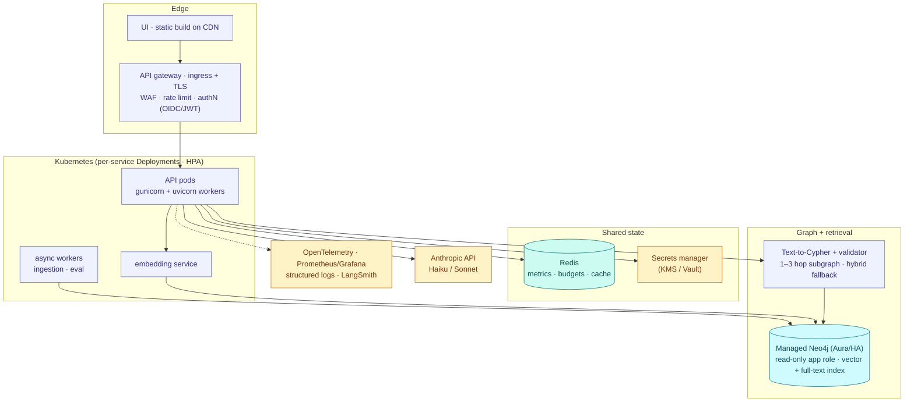

# Production Transition — Architecture Brief

**From:** single-node demo / portfolio build
**To:** multi-tenant SaaS on Kubernetes, large scale (up to millions of nodes)
**Author's lens:** system architect · decision-focused, not a Gantt chart

> Companion to `DESIGN_DECISIONS.md` (why the current build is the way it is) and
> `desing_constraints.md` (the production patterns this brief operationalizes).

---

## 1. Executive summary

CogniGraph has strong *foundations* — a graph data model, hybrid search, agentic
and multi-agent orchestration, input/output safety, an eval harness, 295 tests,
and CI — but it runs as a **single-node demo**: one Neo4j Community container,
dev servers, open CORS, no auth, a hardcoded DB password, in-process global state,
and the **entire graph serialized into every prompt**.

Productionizing it is three headline moves:

1. **Lock it down** — authN/Z, tenant isolation, a **read-only DB role + Cypher
   validation**, and a secrets manager. (Today there is an unauthenticated
   `/admin` endpoint and a `run_cypher` tool that can issue `DETACH DELETE`.)
2. **Make it horizontal** — stateless containers on K8s, **externalized state
   (Redis)**, managed/HA Neo4j, and real observability with SLOs. (Today metrics
   and the cost budget live in a process-global dict — they don't survive a second
   replica.)
3. **Re-architect retrieval** — replace full-graph-in-prompt with **schema-guarded
   Text-to-Cypher → 1–3 hop subgraph → LLM**, with a hybrid fallback. This removes
   the context-window/cost ceiling that caps the current design at ~30 nodes.

Everything in §7 carries forward unchanged; this brief is additive hardening, not
a rewrite.

---

## 2. Current → target architecture

| Layer | Current | Target |
|-------|---------|--------|
| **Edge / API** | uvicorn `--reload`, CORS `allow_origins=["*"]` (`api.py:313`) | Containerized ASGI (gunicorn+uvicorn) behind **API gateway + ingress/TLS**, WAF, scoped CORS, rate limiting |
| **UI** | vite dev server (`:5173`) | Static build on **CDN** |
| **Compute** | two local processes | K8s Deployments, **HPA**, liveness/readiness probes, graceful shutdown |
| **Graph store** | Neo4j Community, 1 container, hardcoded `companygraph123` | **Managed Neo4j Aura / HA causal cluster**, read replicas, **read-only app role**, `execute_read`/`execute_write` split, pooled global driver |
| **Tenancy** | none (one graph) | **Database-per-tenant** (Aura) *or* label/property partitioning with **enforced tenant scoping on every query**; per-tenant quotas |
| **Retrieval** | full graph → cached prompt (`utils.py _format_graph`) | **Text-to-Cypher** (schema-guarded, **AST/allowlist validator**, markdown strip, read-only exec) → **1–3 hop subgraph** → LLM; **hybrid fallback** on empty |
| **Embeddings / search** | in-process `sentence-transformers`, `LIMIT 500` Python scan (`graph.py`) | **Neo4j vector index** (or external store) with precomputed vectors; dedicated embedding service |
| **LLM orchestration** | native-SDK loops (keep) | + **timeouts, retries, circuit breakers**, cumulative-token guards, per-tenant rate limits |
| **State / cost** | process-global `_metrics` + budget (`api.py:59`) | **Redis** for shared metrics, budgets, caches; **per-tenant** budget enforcement |
| **Secrets / config** | `.env`, hardcoded creds | **Secrets manager** (External Secrets + KMS/Vault), 12-factor, no creds in images |
| **Observability** | optional LangSmith + in-app `/metrics` | **OpenTelemetry traces + Prometheus/Grafana + structured logs + SLOs/alerting**; keep LangSmith for LLM runs |

---

## 3. Top production gaps (prioritized)

1. **AuthN/Z + scoped CORS** — no auth today; CORS is `*`; `/admin/reset-budget` is open.
2. **Tenant isolation** — single shared graph; no tenancy boundary or per-tenant limits.
3. **Cypher write-safety** — `run_cypher` (agent + MCP) executes arbitrary Cypher via raw `session.run` (`graph.py:26`); no read-only role, no validator.
4. **Secrets management** — `.env` + hardcoded DB password.
5. **Horizontal state** — metrics/budget are in-process; break across replicas.
6. **Resilience** — no timeouts/retries/circuit breakers on Anthropic or Neo4j; no rate limiting; agent guard is iteration-count only.
7. **Retrieval scale** — full-graph-in-prompt caps usable graph size; needs Text-to-Cypher + subgraph + vector index.
8. **Observability & SLOs** — no OTel/Prometheus, no alerting, no error budgets.
9. **Data governance** — regex PII redaction only; no audit log, retention policy, or GDPR DSAR flow.
10. **Deployment / IaC / HA / DR** — no Dockerfile for API/UI, no Helm/Terraform, no backups or failover.

---

## 4. Architecture principles

- **Least privilege** — read-only Neo4j role for query paths; scoped JWTs; per-tenant credentials.
- **Tenant isolation by design** — every query is tenant-scoped at the data layer, enforced in `graph.py`, not in callers; verified by tests.
- **Stateless services + externalized state** — pods hold no session/metric/budget state; Redis owns it.
- **Defense in depth** — Cypher validator **and** read-only role **and** existing injection/PII guards; no single point of trust.
- **Everything-as-code** — Helm + Terraform, GitOps; no manual cluster changes.
- **Observability & SLOs first-class** — traces/metrics/logs from day one; releases gated on error budgets.
- **Cost governance per tenant** — routing + caching + per-tenant budgets in Redis; cost is a first-class limit, not a surprise.
- **Evals as a release gate** — CD promotes only when the eval harness (entity recall + an LLM-judge dimension) passes.

---

## 5. Sequenced phases (exit criteria, not a Gantt)

**P0 — Harden correctness & security.**
Read-only Neo4j role + switch `graph.py` to `execute_read`/`execute_write`; Cypher
**AST/allowlist validator** + markdown-strip on `run_cypher` and the new
Text-to-Cypher path; real authN/Z (OIDC/JWT) + scoped CORS; move secrets to a
manager; lock `/admin`.
*Exit: no unauthenticated or destructive surface; injection/PII suites green; a
write Cypher from `run_cypher` is rejected at the DB.*

**P1 — Containerize & deploy.**
Dockerfiles (API, UI), Helm chart, managed Neo4j Aura, ingress/TLS; externalize
metrics + budget to Redis; OpenTelemetry + Prometheus; liveness/readiness probes.
*Exit: one-command reproducible deploy to staging; dashboards + traces live;
two API replicas share state correctly.*

**P2 — Multi-tenancy.**
Tenant isolation model (database-per-tenant or partition + enforced scoping);
tenancy claims in auth; per-tenant quotas, rate limits, and budgets; audit log.
*Exit: two tenants provably isolated end-to-end; per-tenant cost caps enforced.*

**P3 — Retrieval re-architecture & scale.**
Text-to-Cypher + validator + 1–3 hop subgraph; Neo4j vector index + hybrid
fallback on empty; **retire full-graph-in-prompt**; load/perf test to target
scale. Run behind a flag alongside the cached-graph path until SLOs prove out.
*Exit: p95 latency + cost/query SLOs met at millions of nodes; cached-graph path
removed.*

**P4 — Reliability & governance.**
SLOs/alerting/on-call; autoscaling tuning; backups/DR; CD with canary + LLM-judge
eval gate; data retention + GDPR DSAR flows.
*Exit: on-call-ready; CD promotes only on eval + SLO pass.*

---

## 6. Risks & trade-offs

| Risk | Mitigation |
|------|------------|
| Text-to-Cypher hallucination / bad syntax | Schema-guarded prompt + AST/allowlist **validator** + **read-only role** + hybrid fallback on empty |
| Tenant data leak | Isolation **by design** at the data layer + isolation tests in CI |
| LLM cost at scale | Three-tier routing + prompt caching + **per-tenant budgets** in Redis |
| Eval/quality drift | Canary deploys + nightly regression + LLM-judge dimension |
| Re-architecture regressions | Text-to-Cypher behind a feature flag, A/B against cached-graph until SLOs hold |

---

## 7. Already production-shaped (carry forward unchanged)

Graph data model + the single `graph.py` data layer · hybrid search
(BM25 + semantic + RRF) · prompt-injection and PII output guards · prompt
versioning in YAML · the offline eval harness · 295 tests + CI · three-tier model
routing + prompt caching + the budget concept · LangSmith/observability hooks ·
the agentic + multi-agent orchestration (native SDK, no framework).

---

## Appendix — mapping `desing_constraints.md` → phases

| Constraint (cheat-sheet #) | Where it lands |
|----------------------------|----------------|
| Read-only DB user (#4, #8) | **P0** |
| `execute_read` + pooled driver (#8) | **P0** |
| Cypher validator / AST (#2) | **P0** |
| Markdown code-block stripping (#6) | **P0** (Text-to-Cypher sanitizer) |
| Ontology / schema enforcement at ingestion (#3) | **P2–P3** (already partly done via forced tool schema in `doc_to_graph.py`) |
| Subgraph retrieval, 1–3 hops (#1, #9) | **P3** |
| Empty-result hybrid fallback (#5) | **P3** (hybrid search already exists — wire it as the fallback) |
| Graph object → primitives via `.data()` (#7) | already handled by `node_dict()` in `graph.py` |
